# Lab: Wykorzystanie ARM template do stworzenia strony internetowej z WordPress

***W budowe!***

## Wymagania
Aktywna subskrypcja w Azure i dostęp do portalu.

## Wstęp
### Cel
Wykorzystanie ARM template do stworzenia strony internetowej.

Czas trwania: 45 minut

### Krok 1 - Określ wymagania
1. Jakie wymagania ma spełniać rozwiązanie?
    1. Funkcjonalne (co "da się" zrobić)
    2. Niefunkcjonalne (bezpieczeństwo, stabilność, kopie bezpieczeństwa, dostępność)
1. Jakich zasobów w Azure potrzebujesz?
    1. Compute
    2. Database
    3. Networking
2. Jaki jest koszt wdrożenia?
3. Jakie zadania są związane z utrzymaniem rozwiązania?

### Krok 2 - Przeanlizuj dostępny szablon

- Otwórz stronę z szablonem: [Quickstart template: Wordpress](https://learn.microsoft.com/en-us/samples/azure/azure-quickstart-templates/aci-wordpress/)

- Otwórz **Visualize** w nowej zakładce - zapoznaj się z uproszczonym schematem zasobów jakie będą wdrożone

- Otwórz [browse code](https://github.com/azure/azure-quickstart-templates/tree/master/application-workloads/wordpress/aci-wordpress) w nowej zakładce - to jest definicja wdrożenia w podejściu ARM i Bicep

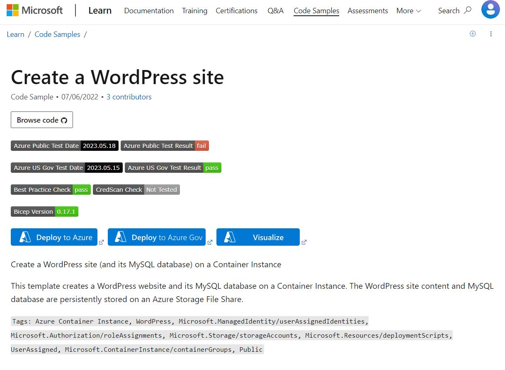

### Krok 3 - Wykonaj wdrożenie (deployment)

- Wybierz "Deploy to Azure"
- Wypełnij formularz
    - **Subscription** - "portfel" albo "rachunek" do którego przypisany jest koszt
    - **Resource group** - "pojemnik" na zasoby, niemal każdy obiekt w Azure musi należeć do Resource groupy
    - **Region** - lokalizacja (kraj) dla Resource group, w którym znajduje się centrum danych, w których Twoje zasoby będą stworzone i trzymane
    - **Storage Account Type** - magazyn pamięci (ałć) - przestrzeń dyskowa pozwalająca na trzymanei danych
    - **Storage Account Name** - nazwa dla storage account - musi być unikalna w skali globalnej
    - **Site Name** - nazwa strony - będzie cześcią adresu
    - **My Sql Password** - hasło do bazy danych, musi spełniać wymagania długości i skomplikowania (jakie? To zależy od użytej technologii)
    - **Location** - region w którym zasób będzie wdrożony (należy pamiętać o RODO jeżeli strona będzie przetwarzać dane osobowe)

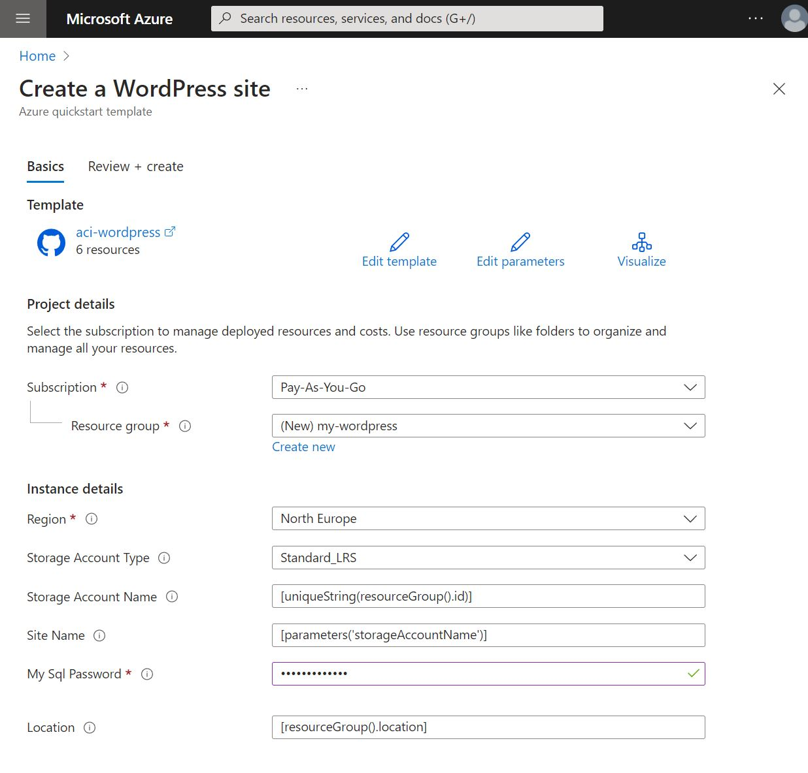

- Wybierz "Next: review + create >"
  Zapoznaj się z informacjami dotyczącymi licencji i warunków użytkowania. Poczekaj również chwilę, aż Azure dokona sprawdzenia czy nie ma błędów w parametrach wdrożenia.

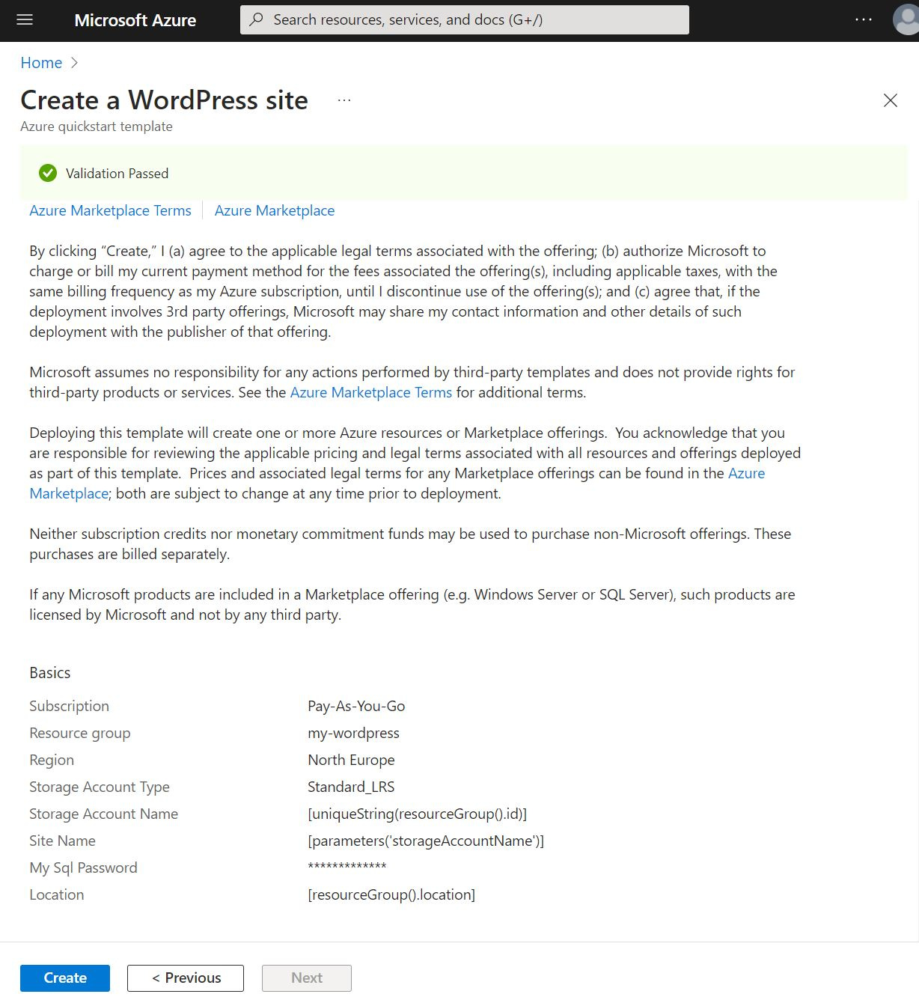

- Wybierz "Create"
  Możesz śledzić postępujące wdrożenie.

  Kiedy zobaczysz, że wszystkie zasoby zostały wdrożone, wybierz "Go to resource group".

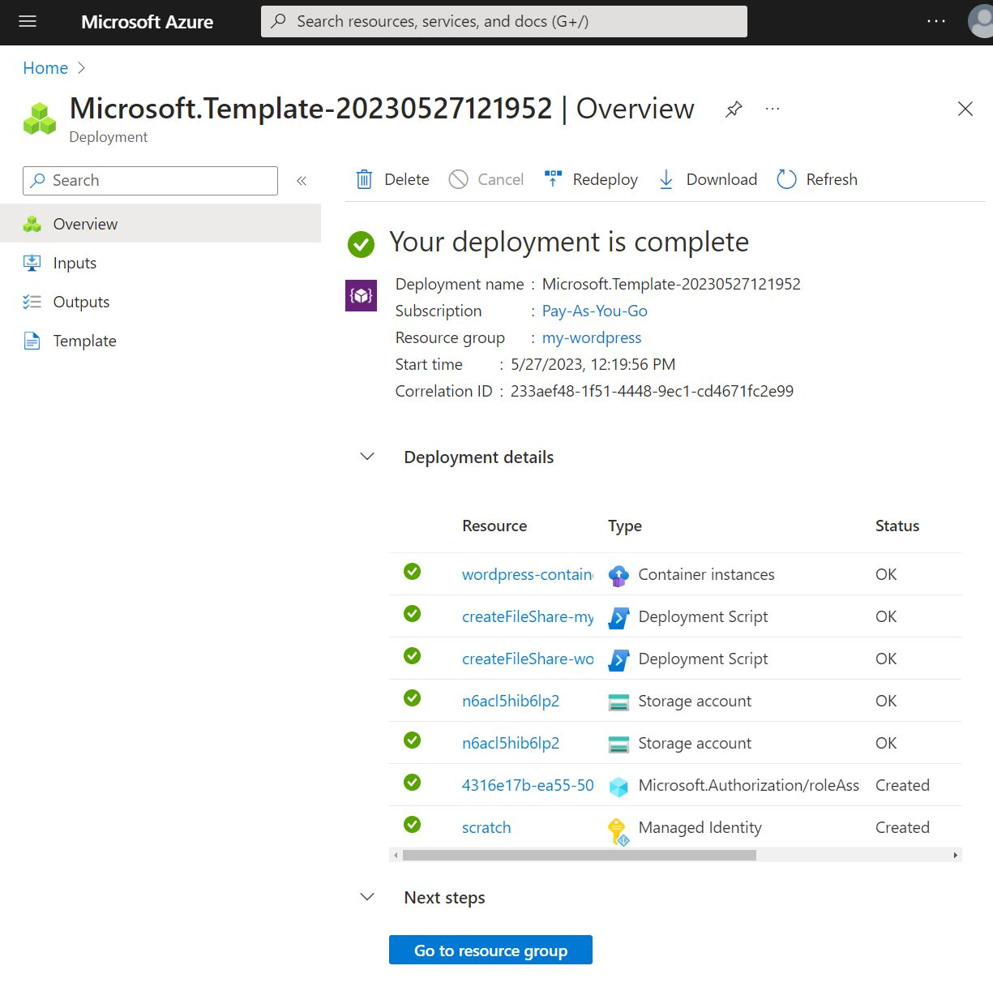

-  Znajdź swoje zasoby i otwórz `wordpress-containerinstance`

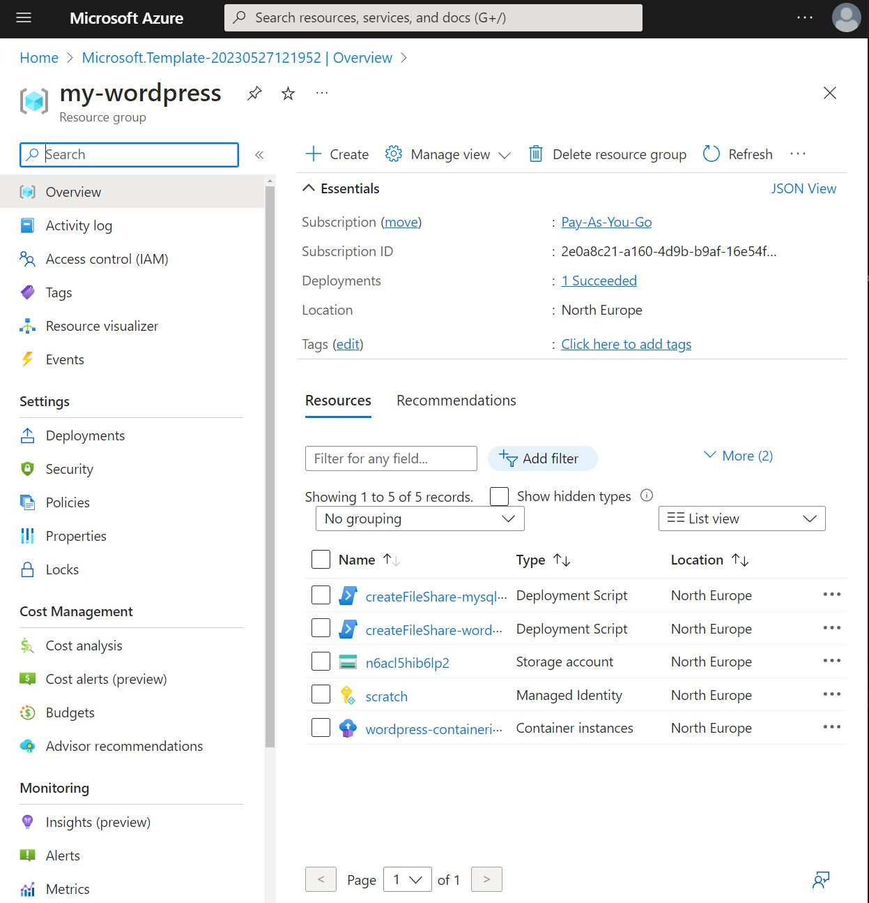

### Krok 4 - Skonfiguruj Wordpress
- Z poziomu zasobu `wordpress-containerinstance` znajdź własność "FQDN", skopiuj tę wartość i wklej do przeglądrki

"FQDN", czyli "full qualified domain name" to w tym przypadku po prostu adres, pod którym znajdziesz stronę

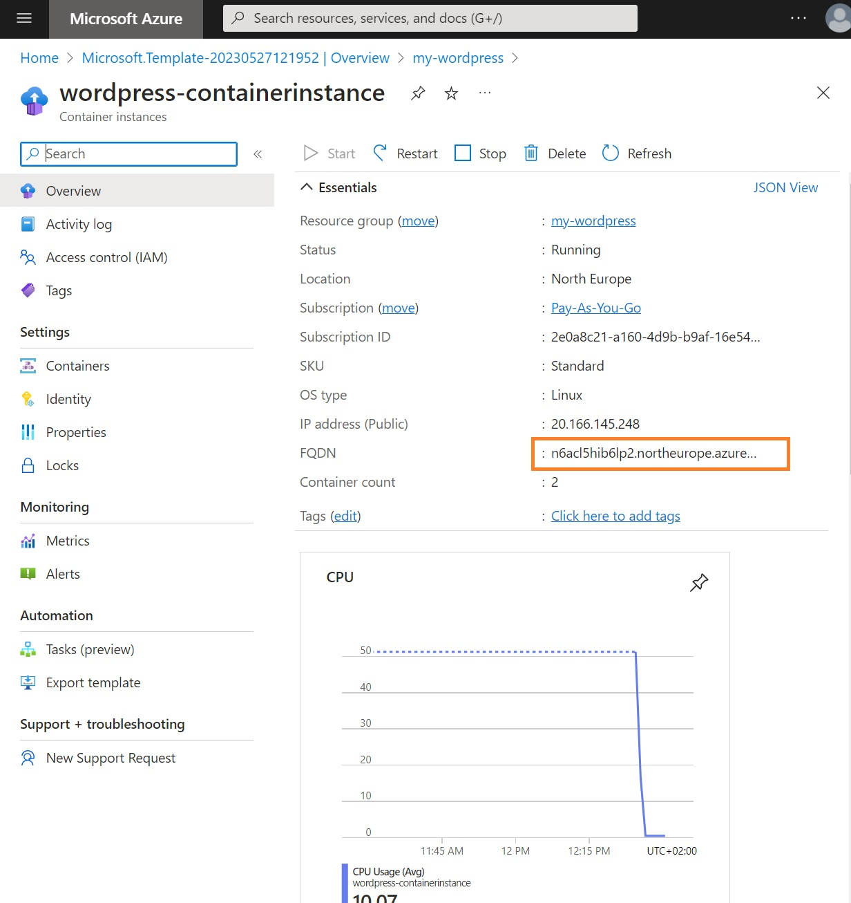

- Pod adresem pozyskanym z własności "FQDN" znajduje się portal konfiguracji wordpress. Postępuj z krokami, zapisz hasło na boku, ponieważ będzie niezbędne do zalogowania się.

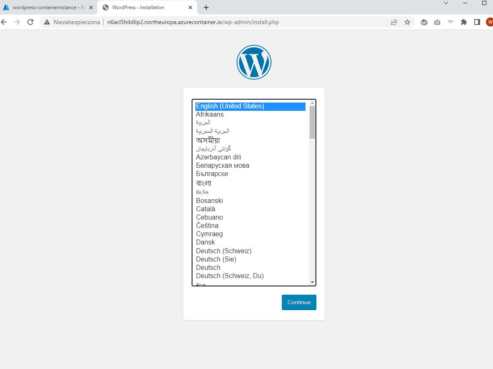

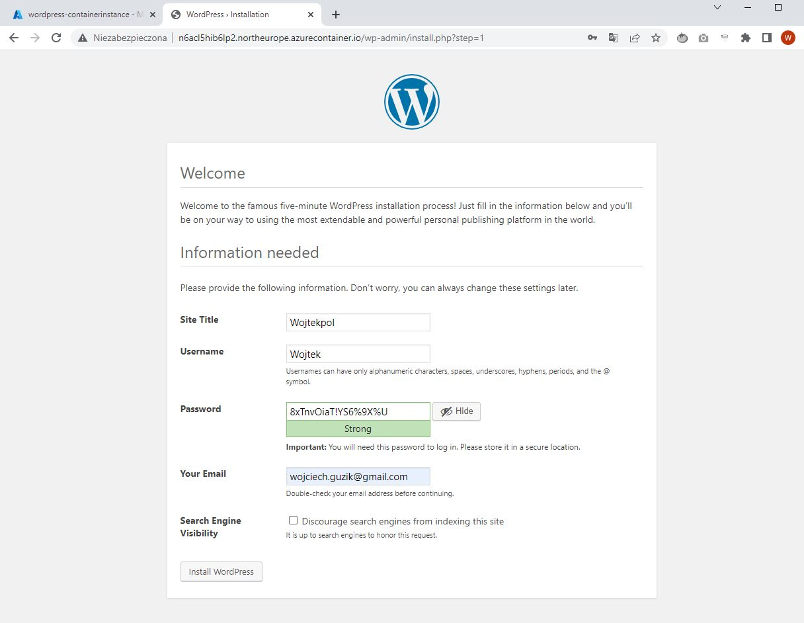

 Odczekaj kilka chwil i zaloguj się do wordpress.

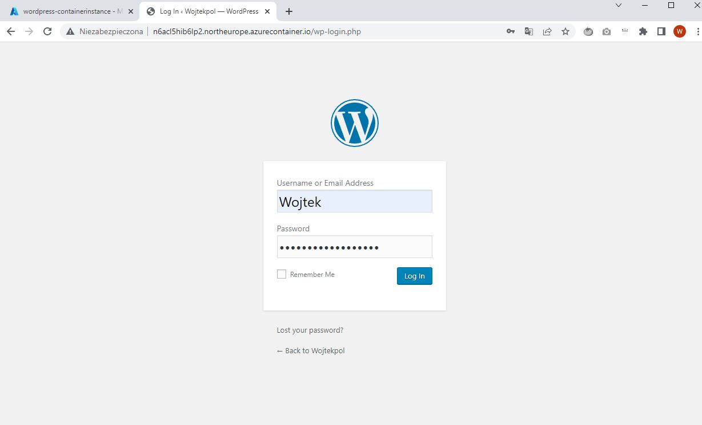

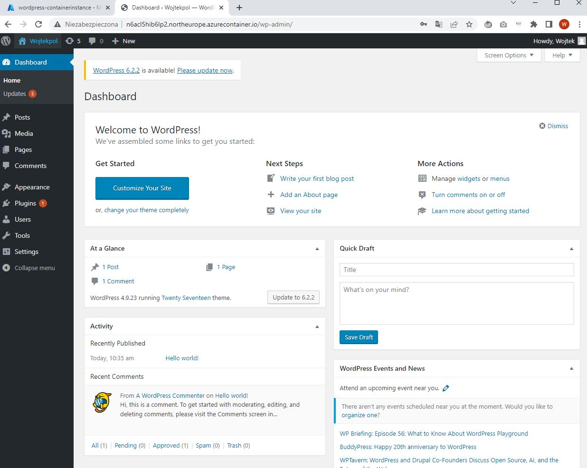

Możesz skonfigurować stronę wedle upodobań, zainstalować szablony, pluginy, dodawać posty lub informacje na temat swojej firmy lub bloga.

### Kork 5 - Przeanalizuj infrastrukturę
- W portalu Azure znajdź Resource group ze swoim wdrożeniem i znajdź `wordpress-containerinstance`

Zauważ, że po wybraniu "Containers" z menu po lewej widzisz "wordpress" oraz "mysql". W przypadku tego wdrożenia nie korzystasz z bazy danych w modelu SaaS lub PaaS, ale "hostujesz" własną instalację bazy w ramach usługi. Oznacza to, że nie masz super mocy w postaci kopii zapasowej, aktualizacji bezpieczeństwa ani integracji, dopóki ich sam(a) nie skonfigurujesz.
Wybierz:
Containers > wordpress > connect > `bin/sh` i "Connect"

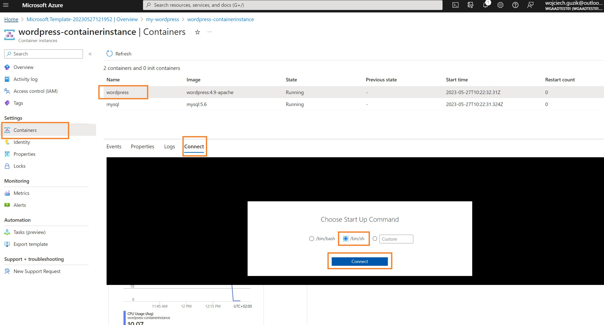

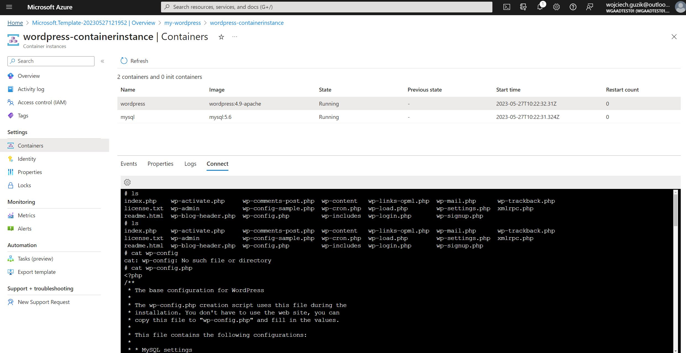
