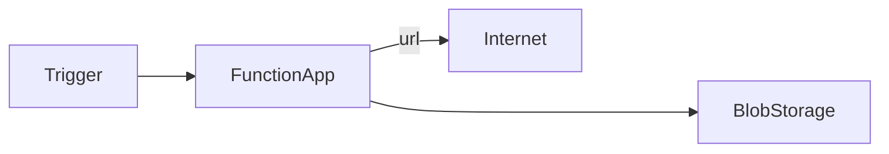
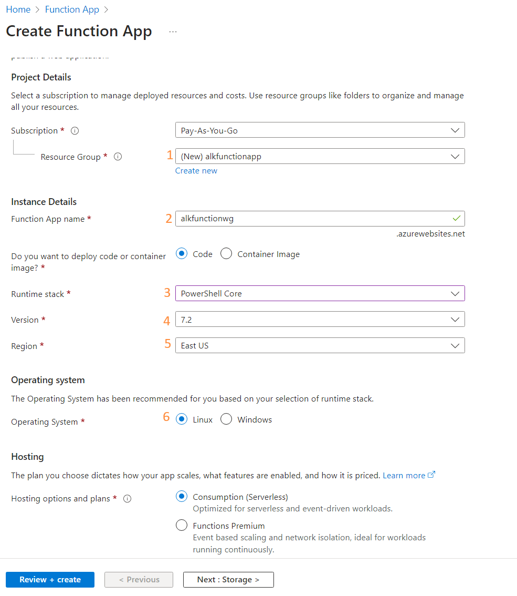
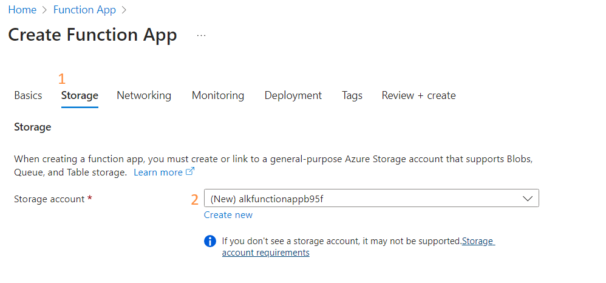

# Lab: Create Azure function that saves data in blob

## Requirements

- Active Azure subscription

## Introduction

Azure Function follows Function as a Service pattern and it allows to run single function and integrate them with other Azure components like Storage Accounts or databases.

## Goal

Create Azure function that validates URL availability and saves output to Blob storage.

## Step 1

Navigate to Azure Portal, find in search "Function App" and select "+ Create".

Then fill details:

Ensure you have set [3] Runtime stack set to "PowerShell Core"

Select tab "Storage" and ensure you will create one along:

Check what are "Networking" and "Monitoring" options - you may need them in the future.

Hit "Review + create" and "Create" to create resource.

## Step 2

Open your Function app, you can find it via search bar after entering "Function App" - it will show up on the list or from "Go to resource" button from deployment page.

From main screen select "Create function" and follow with creator:
(1) Select a template -> "HTTP trigger"
(2) Template details -> Function name: "GetUrlStatus", Authorization level: "Anonymous"

> Check documentation what these options are meant for and propose right setting for project.

Hit "Create" and wait few seconds.

## Step 3
