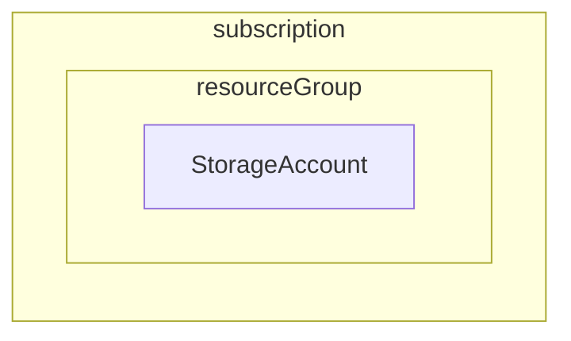

# Lab: Wykorzystanie narzędzi konsoli: PowerShell i az cli do tworzenia infrastruktury

## Wymagania
Aktywna subskrypcja w Azure i dostęp do [portalu](https://portal.azure.com).

> Nie masz konta w Azure? [Załóż darmowe konto](/https://azure.microsoft.com/en-us/free/) (uwaga, nowe konta posiadają dodatkowe środki, ale po ich wykorzystaniu zostanie obciążona Twoja karta. Pamiętaj o usuwaniu zasobów, jeżeli nie są potrzebne.)

## Wstęp
### Cel
Wykorzystanie PowerShella i az cli do tworzenia infrastruktury w Azure.

Czas trwania: xx minut

### Polecenia PowerShell
Polecenia PowerShella mają składnię `Verb-Noun -ParamName ParamValue`, gdzie
- `Verb` opisuje akcję jaką chcesz wykonać, np. `New`, `Stop`,
- `Noun` dotyczy typu obiektu wobec którego akcja ma być wykonana, np. `AzVM`,
- `-ParamName` większość poleceń przyjmuje parametry, które opisują szczegóły obiektu, np. nazwa maszyny wirtualnej albo wartość nowej cechy, którą chcesz nadać, parametrów zwykle jest kilka. Większość poleceń wymaga podania wartości dla kilku wymaganych parametrów do właściwego działania.

```PowerShell
# Tworzy maszynę wirtualną o nazwie "MyVm", na etapie tworzenia prosi o podanie danych dostępowych, które zostaną wykorzystane na stworzonej maszynie
New-AzVM -Name MyVm -Credential (Get-Credential)
```

```PowerShell
# Pokazuje przykłady użycia danego polecenia
Get-Help New-AzVM -Example
```

Uwagi:
- PowerShell jest językiem obiektowym, można podejrzeć właściwości bądź wywoływać metody:
  
  ```PowerShell
  # Zapisz stan obiektu do zmiennej
  $myStorageAccount =  Get-AzStorageAccount -ResourceGroupName "RG01" -Name "mystorageaccount"

  # Podejrzyj dostępne właściwości i metody
  Get-ChildItem $myStorageAccount

  # Wyświetl jedną z nich
  $myStorageAccount.name
  ```
- Wspiera potoki (pipelines), np. 
  ```PowerShell
  # wylistuje wszystkie Storage Account, a później spróbuje je usunąć, BARDZO destrukcyjne polecenie
  Get-AzStorageAccount | Remove-AzStorageAccount
  ```
- Nazwy poleceń nie są wrażliwie na wielkość liter, ale wartości parametrów mogą być, jeżeli platforma tego wymaga
- Używa zmiennych, stałych itd., pozwala tworzyć własne funkcje

### Krok 0 - Uruchom Cloud Shell w Azure i sklonuj kod ćwiczeń Nawiguj w przeglądarce do [portal.azure.com](https://portal.azure.com), uruchom "Cloud Shell" i wybierz `Bash`.  Oficjalna dokumentacja: [Cloud Shell Quickstart](https://github.com/MicrosoftDocs/azure-docs/blob/main/articles/cloud-shell/quickstart.md).
```bash
git clone https://github.com/wguzik/
```

> Poniższe kroki realizuje się za pomocą Cloud Shell.


### Krok 1 - Naszkicuj architekturę



### Krok 2 - Utwórz nazwy i zachowaj je w postaci zmiennych

Uruchamiaj po kolei polecenia z pliku `infra.ps1`.