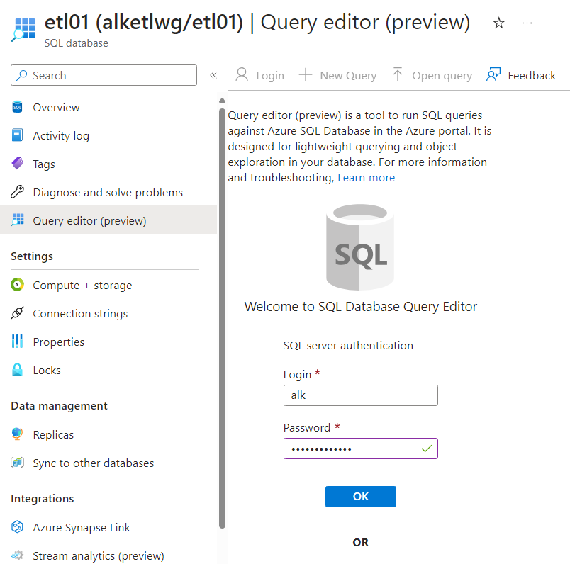

# Lab: Simple ETL with Azure Function, Azure Data Factory and Azure SQL

## Requirements

- Active Azure subscription

## Introduction

**E**xtract **T**ransform **L**oad is common way to deal with data, where you need to handle some source and then reorganize it's content before it has usable form for you.

Azure Function follows Function as a Service pattern and it allows to run single function and integrate them with other Azure components like Storage Accounts or databases. In some sense Azure Function will perform ETL process, but why not to have more than one as part of entire project?

Azure Data Factory is entire framework that allows to transform and save data.

As storage solution we will be using Blob on Storage Account and Azure SQL.

## Goal


## Step 1

Navigate to Azure Portal, find in search "Function App" and select "+ Create".

Then fill details:

[1] create new Resource Group, pick meaningful name.  
[2] this name has to be globally unique, think about adding random number or your initials.  
[3] Ensure you have `Runtime stack` set to "PowerShell Core"

Select tab "Storage" and ensure you will create one along:


Check what are "Networking" and "Monitoring" options - you may need them in the future.

Hit "Review + create" and "Create" to create resource.

## Step 2

Open your Function app, you can find it via search bar after entering "Function App" - it will show up on the list or from "Go to resource" button from deployment page.

From main screen select "Create function" and follow with creator:
(1) Select a template -> "HTTP trigger"
(2) Template details -> Function name: "GetUrlStatus", Authorization level: "Anonymous"

> Check documentation what these options are meant for and propose right setting for the project.

Hit "Create" and wait few seconds.

## Step 3

From function view select "Integration" and then Add "Output".

Go with defaults, write down value for `Blob parameter name` and `Path`.

Hit "Add" and confirm that "Outputs" field contains now two options:
- HTTP (Response)
- Azure Blob Storage (outputBlob)


## Step 4

From function view select "Code + Test" and replace code with of file `run.ps1` within this repo and hit "Save" on top of the page.

From top menu select "Test/Run" and in `Body` put:

```json
{"url":"https://www.google.com"}
```

and then hit "Run". You should see HTTP response code `200 OK`.


## Step 5


Go to `Resource group` and find storage account there. Open it and select `Containers` from left menu. Select [2] `outcontainers`.

No access? No wonder!


Go to Storage Account and select `Configuration`, then set `Allow Blob anonymous access` to `Enabled` and then click `Save` on top left corner.

> Is it good idea?


Go back to `Containers` and then `outcontainer`, from top menu select `Change access level` and from drop down select [2] `Container (anonymous read access for containers and blobs)` and hit `OK`. Wait few minutes for change to applied.

Refresh page and find file with long name, select "Edit" tab to see content (as this is plain text file):

```json
{"Date":"2024-04- 24-16:50","params":{"PageUrl":"https://www.google.com","PageTitle":"Google","HttpStatus":{"PageStatus":200,"StatusDescription":"OK"}}}
```

> Play around and run function with different URLs, see what files are generated.
> Is naming convention any functional? 

## Step 6

In top search bar type "Azure SQL" and select "Create". Select "SQL databases" and "Single database".
Fill form with basic information, select the same Resource group where Function App resides.


For server select "create new" and propose unique meaningful name, then location ideally same as Function App (it may be not possible for Student subscription, use any other that is relatively close).

For "Authentication method" select "Use SQL authentication" and write down used user and secret password. Confirm with OK.

Back on database configuration page for "Compute + storage" select "Basic" tier as you don't need to burn money here.

For "Backup storage redundancy" select "Locally-redundant backup storage".

On tab "Networking" for "Connectivity method" select "Public endpoint". Wait for resource to be deployed and open it's page.

## Step 7


From left menu select "Networking" [1], then change [2] "Public network access" to "Selected networks".

From [3] "Firewall rules" click "+ Add tour IPv4 address (_IP_) and select [4] "Allow Azure services and resources to access this server" and then "Save".

## Step 8

From left menu select "SQL Databases", find your database and click on it to move to it's page".



From left menu select "Query editor (preview)" and login with credentials used during database creation.


In query editor paste content of [urls.sql](./urls.sql) file and hit "run".

You can confirm existence of table by using query:

```sql
SELECT * FROM INFORMATION_SCHEMA.TABLES WHERE TABLE_TYPE='BASE TABLE'
```

## Step 9


In top search bar type "Data Factories" and select "Create". Select same Resource group where Function App resides and propose unique name. It should be meaningful to the project.
On "Networking" tab ensure "Connect via" is set to `Public endpoint`. Hit "Review + create" and again "Create".

Open Data Factory once created and select "Launch studio" from main page.

## Step 10

Configure linked services:
- Blob
- Azure SQL


Select "Manage" from left menu and then "Linked services", then "+ New", then search for Blob.


Select details of your Subscription and Storage Account details, at the bottom hit "Test connection" to be sure that your Data Factory is able to connect to Storage Account.


Select "Manage" from left menu and then "Linked services", then "+ New", then search for "Azure SQL" and follow with configuration using details of SQL server from your subscription and database created in previous steps, Use SQL authentication and confirm creation.

## Step 11

Configure datasets:
- Blob
- Azure SQL


Select "Author" from left menu and then "Datasets" > "New dataset", then search for Blob, then select "JSON", hit "Continue". For "Linked service" select your linked service for Blob and then [2] by clicking directory icon open container and select sample file there, confirm with "OK". Examine properties, like "Schema".

Hit again "Datasets" and three dots and "New dataset", then search for "Azure SQL database". Select your "Linked service" and "Table name", confirm with "OK". Examine "Schema" tab.

## Step 12


Select "Author" and "Pipelines" > "New pipeline". From "Move and transform" select "Copy data" and move to main area.


Select tab "Source" and for "Source dataset" select "Json1".


Select tab "Sink" and for "Source dataset" select "AzureSqlTable1".


Select tab "Mapping" and for "Source dataset" select "Import schemas". Once Data Factory suggest own mapping, make few changes, eg. map proper fields and unselect ones that do not have columns created. Once ready, hit "Debug" on top of page. Wait few minutes.

## Step 13

Navigate to SQL database and run query:

```sql
SELECT * FROM dbo.URLs
```

Can you see your data?

If yes, go back do Data Factory and hit "Publish" to make your project live!

## Step 14

Clean up - do not forget to remove resources if not needed!
