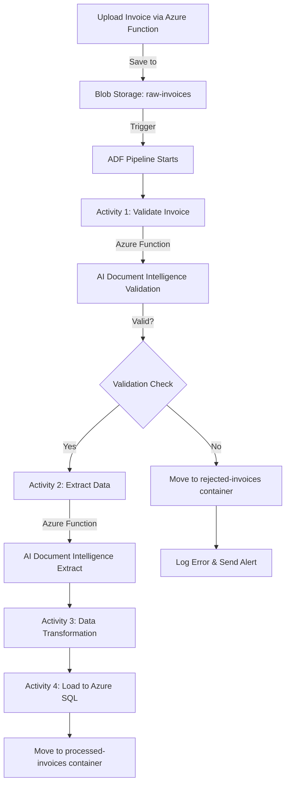

```mermaid
graph TD
    A[Upload Invoice via Azure Function] -->|Save to| B[Blob Storage: raw-invoices]
    B -->|Trigger| C[ADF Pipeline Starts]
    C --> D[Activity 1: Validate Invoice]
    D -->|Azure Function| E[AI Document Intelligence Validation]
    E -->|Valid?| F{Validation Check}
    F -->|No| G[Move to rejected-invoices container]
    F -->|Yes| H[Activity 2: Extract Data]
    H -->|Azure Function| I[AI Document Intelligence Extract]
    I --> J[Activity 3: Data Transformation]
    J --> K[Activity 4: Load to Azure SQL]
    K --> L[Move to processed-invoices container]
    G --> M[Log Error & Send Alert]
```
